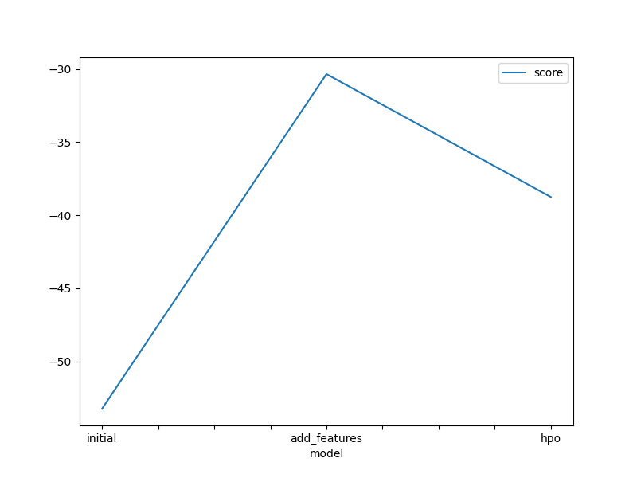
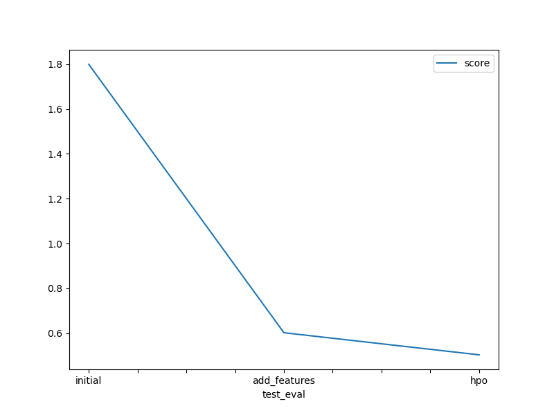

# Report: Predict Bike Sharing Demand with AutoGluon Solution
#### RAHEEMAT FAREEDAH BALOGUN

## Initial Training
### What did you realize when you tried to submit your predictions? What changes were needed to the output of the predictor to submit your results?
TODO: I realized that kaggle will reject submissions if there are negative prediction values and that the submission has to be in a specific format that has been specifies. In this case it had 2 columns namely 'datetime' and 'count'

### What was the top ranked model that performed?
TODO: The top-ranked model was a WeightedEnsemble_L3 which combines multiple model (such as LightGBM, CatBoost, and neural networks) for improved performance. 

## Exploratory data analysis and feature creation
### What did the exploratory analysis find and how did you add additional features?
TODO: During the exploratory data analysis (EDA), several key patterns were identified in the bike-sharing dataset. The analysis revealed that seasonality does not significantly affect bike demand, as the distribution remains relatively consistent across all seasons. However, demand varies noticeably based on holidays and working days. Specifically, bike usage is significantly lower on holidays and non-working days, whereas there is a marked increase on regular working days. Weather conditions also play an important role: days characterized by clear skies or few clouds tend to have higher bike demand, while days with heavy rain or overcast skies show reduced usage. Temperature was another influential factor; extreme temperatures, such as those near 0°C or around 40°C, correlate with minimal bike usage, while mild temperatures support higher demand.
I added additional features by dividing the datetime column into day, month, and hour. I did that using the .dt function and by changing the datatype pf season and weather and season column to caterory using the .astype function.

### How much better did your model preform after adding additional features and why do you think that is?
TODO: After adding the new features, the model's RMSE score on the improved by approximately 66%. This improvement is likely due to the model having more granular, relevant information about external conditions that influence demand.

## Hyper parameter tuning
### How much better did your model preform after trying different hyper parameters?
TODO: When I manually adjusted hyperparameters, I observed a performance gain of about approximately 17%. 

### If you were given more time with this dataset, where do you think you would spend more time?
TODO: If given more time, I would explore feature interactions, such as interaction terms between weather and hour or holiday and day of the week.

### Create a table with the models you ran, the hyperparameters modified, and the kaggle score.
|model|hpo1|hpo2|hpo3|score|
|--|--|--|--|--|
|initial|default|default|default|1.79907|
|add_features|default|default|default|0.60243|
|hpo|learning_rate: 0.05|num_boost_round: 100|num_epochs:10|0.50390

### Create a line plot showing the top model score for the three (or more) training runs during the project.

TODO: Replace the image below with your own.

### Create a line plot showing the top kaggle score for the three (or more) prediction submissions during the project.

TODO: Replace the image below with your own.

## Summary
TODO: In this project, I used AutoGluon to predict bike sharing demand. Initially, a high-quality ensemble model provided strong baseline results. By performing exploratory data analysis, I identified key categorical features that improved model accuracy significantly. Further hyperparameter tuning refined performance slightly, though AutoGluon’s default strategies are already strong. With more time, I would delve deeper into advanced feature engineering. Overall, this project demonstrated the power of automated machine learning in solving real-world forecasting problems.